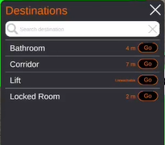
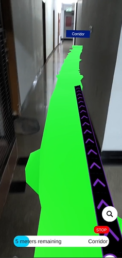
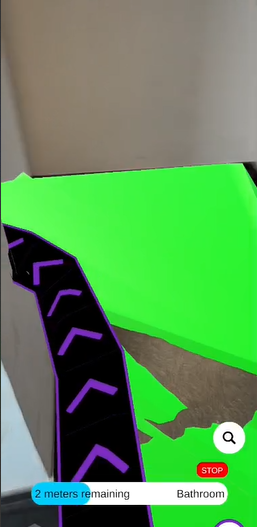

# Perceiva: A Multi-Sensory AR Navigation Assistant

**Perceiva** is an assistive indoor navigation system built using Unity and C#, designed to support individuals with cognitive and visual impairments. Leveraging a LiDAR-scanned point-cloud environment, the app overlays real-time Augmented Reality (AR) guidance with voice, haptic, and gesture-based interaction to provide intuitive and accessible indoor wayfinding.

---

## 🔍 Features

### 🧠 Multi-Modal Interaction
- **Voice commands** (STT) for destination input and **Text-to-Speech** (TTS) for real-time feedback
- **Gesture support** with triple-tap detection and touch UI swipes
- **Haptic feedback** for directional cues and no-eye navigation
- **AR overlays** with 3D path visualization using Unity's NavMesh and MultiSet SDK

### 🗺️ Smart Indoor Navigation
- Utilizes **LiDAR/ToF**-based spatial mapping (via MultiSet AI SDK)
- Supports **multi-floor buildings** with stair and elevator awareness
- Real-time recalculation of paths on dynamic layout updates

### 📦 Offline-Capable Architecture
- Entire point cloud and POI definitions are preloaded
- No real-time cloud dependency once mapping is done
- Designed for use in hospitals, homes, hotels and transit spaces

### 📊 Experimental Outcomes
- Highly successful testing in real locations
- Proven practical use by testing with blindfolded people

---

## 🛠️ Tech Stack

| Component            | Technology                     |
|---------------------|--------------------------------|
| AR Framework        | Unity 2021.3 LTS + ARFoundation|
| Programming Language| C#                             |
| Point Cloud Mapping | MultiSet AI SDK (LiDAR-based)  |
| Voice Support       | Android TTS/STT APIs           |
| Haptics             | Handheld.Vibrate()             |

---

## 🧭 Workflow Overview

1. **Caregiver maps the environment** using MultiSet AI and exports anchor data.
2. **Developer imports and bakes** NavMesh and POIs inside Unity.
3. **User launches the app** to select destinations via voice or touch.
4. **AR path, haptics, and TTS feedback** guide the user in real-time.
5. **Arrival is detected** via proximity sensors and feedback resets the interface.

---

## Video Demonstrations of Working

<table>
  <tr>
    <td align="center" width="50%">
      
       <b>Demo of Gesture Control and Voice Interaction</b>
    </td>
    <td align="center" width="50%">
      
       <b>Demo of GUI</b>
    </td>
  </tr>
</table>

---

## Screenshots of App

  <table>
    <tr>
      <td align="center" valign="center" title="POI Selection UI">
         
        <b>POI Selection UI</b>
      </td>
      <td align="center" valign="center">
         
        <b>AR Path Visualization</b>
      </td>
      <td align="center" valign="center">
         
        <b>Navigation Through Corners</b>
      </td>
    </tr>
  </table>

---
